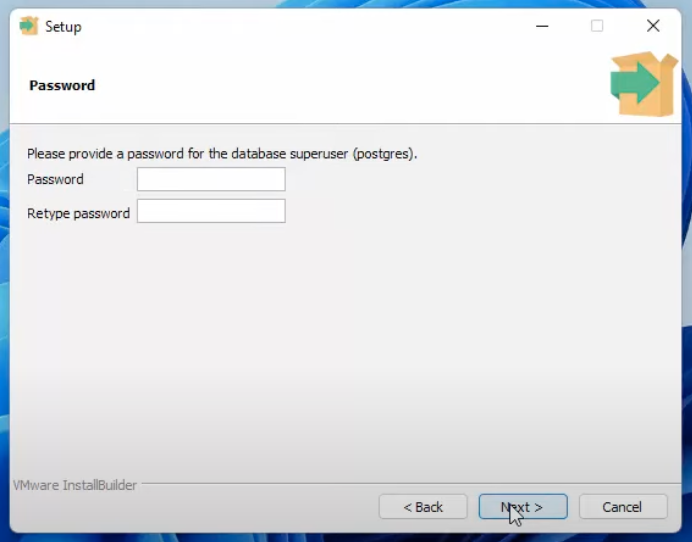

# Installing pgAdmin and PostgreSQL

## Installation
1. Navigate to the [installer](https://www.enterprisedb.com/downloads/postgres-postgresql-downloads) and download the latest version for your operating system
2. When you reach the "Select Components" step, make sure you have every item check-marked
3. **Important** Set and remember your password at this stage, as you will use this password to access pgAdmin!  

4. Leave the port as the default port
5. Keep clicking next until the installation is finished. You can ignore Stack Builder at the end

## Setup
1. Open pgAdmin and expand the "Servers" section on the left. You will be asked to enter the password you created during the installer
2. You should now see a "databases" section. To create a new database, right click on "databases" > Create > Database..
3. Name the database whatever, and do not worry about the other settings
4. With your new database selected, click the query tool. You should have space to write SQL code now
5. In this space, copy and paste everything from setup.sql and select "Execute Script", which should look like a play button. Refresh your database, and you should see the empty tables in database > Schemas > Tables
6. Open the query tool again and create mock data for each of the tables by copying and pasting everything from mockdata.sql and execute

This [video](https://www.youtube.com/watch?v=4qH-7w5LZsA) details everything here.
